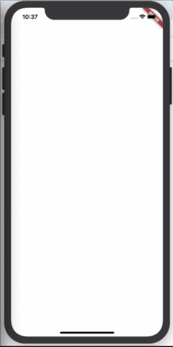
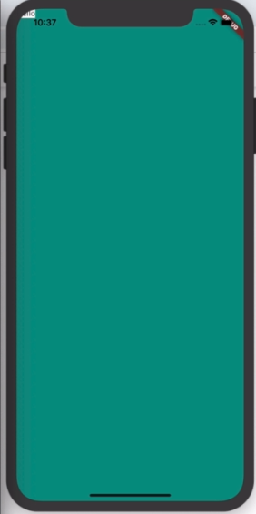
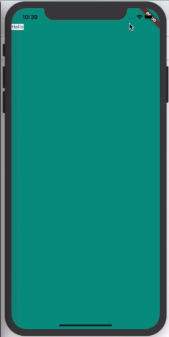

### Stateless Widget 

## Container with no child try to as big as possible.

````dart
import 'dart:io';

import 'package:flutter/cupertino.dart';
import 'package:flutter/material.dart';

void main() {
  runApp(
   MyApp(),
  );
}
class MyApp extends StatelessWidget {
  @override
  Widget build(BuildContext context) {
    return  MaterialApp(
      home: Scaffold(
        backgroundColor: Colors.teal,
        body: Container(
            color: Colors.white,
        ),
      ),
    );
  }
}

````
## Result: 


## Container have a child. so it shrinks.

````dart
import 'dart:io';

import 'package:flutter/cupertino.dart';
import 'package:flutter/material.dart';

void main() {
  runApp(
   MyApp(),
  );
}
class MyApp extends StatelessWidget {
  @override
  Widget build(BuildContext context) {
    return  MaterialApp(
      home: Scaffold(
        backgroundColor: Colors.teal,
        body: Container(
            child: Text("Hello"),
            color: Colors.white,
        ),
      ),
    );
  }
}

````
## Result: 




## SafeArea

Keep safe from border, notch, bazel with help of safearea. 
> hold `alt` and press enter.  choose `Warp with a new Widget`.
````dart 

class MyApp extends StatelessWidget {
  @override
  Widget build(BuildContext context) {
    return  MaterialApp(
      home: Scaffold(
        backgroundColor: Colors.teal,
        body: SafeArea(
          child: Container(
            child: Text("Hello"),
            color: Colors.white,
          ),

        ),
      ),
    );
  }
}
````
### Result


## padding and margin

````dart
class MyApp extends StatelessWidget {
  @override
  Widget build(BuildContext context) {
    return  MaterialApp(
      home: Scaffold(
        backgroundColor: Colors.red,
        body: SafeArea(
          child: Container(
            height: 100.0,
            width: 100.0,
            child: Text("Hello"),
            color: Colors.white,
            padding: EdgeInsets.all(10.0),
            margin: EdgeInsets.fromLTRB(100.0,70.0,50.0,300.0),
          ),

        ),
      ),
    );
  }
}
````